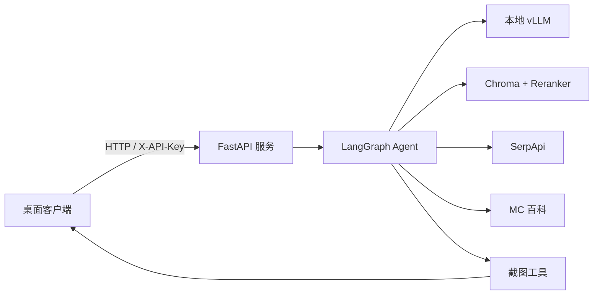

# Desktop Assistant

一个面向本地大模型的桌面智能体服务。项目以 vLLM 提供 OpenAI 兼容接口，通过 LangChain/LangGraph 组织 Agent 工作流，并结合本地知识库、联网搜索、Minecraft 百科查询和屏幕截图能力，为桌面端提供可持续的多轮对话体验。

## 功能特性

- **本地大模型对话**：连接本地 vLLM Chat、Embedding 和 Reranker 服务。
- **RAG 知识库检索**：使用 Chroma 向量库检索本地资料，并通过 CrossEncoder 重排序。
- **联网搜索**：通过 SerpApi 获取实时 Google 搜索结果。
- **MC 百科查询**：查询 MC 百科物品信息及相关评论。
- **屏幕理解**：客户端倒计时截屏，服务端按需读取截图并继续当前会话。
- **流式响应**：通过 NDJSON 推送 Agent 工具调用进度和最终结果。
- **会话记忆**：使用 LangGraph `MemorySaver` 按 `thread_id` 保存对话上下文。
- **接口鉴权**：可通过 `X-API-Key` 请求头保护聊天和截图接口。
- **日志记录**：记录对话、工具调用、模型输出和异常信息，便于调试。

## 工作流程



用户问题进入 Agent 后，模型会根据问题自主选择工具。工具返回结果后，Agent 汇总上下文并生成最终回答；如果需要了解当前屏幕内容，服务端会请求客户端截图，客户端上传后继续原会话。

## 项目结构

```text
Agent_Master/
├── agent/                 # Agent 构建与核心对话流程
├── client/                # 命令行客户端与截图上传逻辑
├── infrastructure/        # Chat、Embedding、向量库和重排模型加载
├── tools/                 # RAG、联网搜索、MC 查询、截图工具
├── tests/                 # Agent 调试与检索测试
├── app.py                 # FastAPI 服务入口
├── config.py              # 环境变量和本地模型配置
├── logging_config.py      # 日志配置
├── .env.example           # 环境变量模板
└── requirements.txt       # Python 基础依赖
```

## 环境要求

- Python 3.9+
- 可用的本地 vLLM OpenAI 兼容服务
- CUDA 环境（Embedding、Reranker 和本地模型通常需要 GPU）
- 已准备好的 Chroma 向量库和角色描述文件
- SerpApi API Key（仅使用联网搜索时需要）

## 安装

```bash
git clone git@github.com:yupx123321-star/Desktop_Assistant.git
cd Desktop_Assistant

conda create -n desktop-assistant python=3.10 -y
conda activate desktop-assistant

pip install -r requirements.txt
```

项目运行还依赖代码中使用的 FastAPI、LangChain、LangGraph、Chroma、Sentence Transformers、Requests、BeautifulSoup 等库，请根据当前 CUDA、PyTorch 和 vLLM 环境安装匹配版本。例如：

```bash
pip install fastapi uvicorn requests pillow mss beautifulsoup4 lxml \
  langchain langchain-core langchain-openai langchain-chroma \
  langgraph sentence-transformers serpapi
```

## 配置

复制环境变量模板：

```bash
cp .env.example .env
```

编辑 `.env`：

```dotenv
SERPAPI_API_KEY=your_serpapi_key
AGENT_API_KEY=replace_with_a_long_random_agent_key
LLM_API_KEY=EMPTY
```

真实密钥只放在本地 `.env` 中，不要提交到 GitHub。项目已经通过 `.gitignore` 忽略 `.env`。

模型、向量库和截图目录目前在 `config.py` 中配置，部署前请按实际路径修改：

- `CHAT_MODEL`、`CHAT_BASE_URL`
- `EMBED_MODEL`、`EMBED_BASE_URL`
- `RERANKER_MODEL`、`RERANKER_DEVICE`
- `PERSIST_DIR`
- `ROLE_DESC_PATH`
- `SCREENSHOT_DIR`

其中 `ROLE_DESC_PATH` 指向 Agent 的角色描述文件，`PERSIST_DIR` 指向已经构建好的 Chroma 数据目录。

## 启动服务

确保 Chat、Embedding 服务已经运行，并且地址与 `config.py` 中的配置一致，然后启动 FastAPI：

```bash
cd Agent_Master
python app.py
```

默认服务地址：

```text
http://localhost:8002
```

也可以使用 Uvicorn：

```bash
uvicorn app:app --host 0.0.0.0 --port 8002
```

健康检查：

```bash
curl http://localhost:8002/health
```

返回：

```json
{"status":"ok"}
```

## 使用客户端

服务端启动完成后，在另一个终端运行：

```bash
cd Agent_Master
python -m client
```

客户端默认连接 `localhost:8002`，并从 `.env` 读取 `AGENT_API_KEY`。也可以手动指定参数：

```bash
python -m client \
  --host localhost \
  --port 8002 \
  --api-key "$AGENT_API_KEY" \
  --quality 70
```

输入 `exit` 退出客户端。涉及当前屏幕内容的问题，客户端会按服务端指令倒计时截图并上传。

## API 接口

### 健康检查

```http
GET /health
```

### 普通对话

```http
POST /chat
X-API-Key: your_agent_api_key
Content-Type: application/json
```

请求示例：

```json
{
  "query": "请介绍一下本地知识库中的内容",
  "thread_id": "demo-session"
}
```

### 流式对话

```http
POST /chat/stream
X-API-Key: your_agent_api_key
Content-Type: application/json
```

响应为逐行返回的 NDJSON，事件类型包括 `progress`、`result` 和 `error`。

### 上传截图

```http
POST /screenshot
X-API-Key: your_agent_api_key
Content-Type: application/json
```

```json
{
  "image": "base64_encoded_jpeg",
  "thread_id": "demo-session"
}
```

当 `AGENT_API_KEY` 未配置时，服务会跳过鉴权，仅适合本地开发环境。对外部署时务必设置强随机密钥，并建议放在反向代理或内网访问控制之后。

## 测试与调试

运行语法检查：

```bash
python -m py_compile config.py client/agent_client.py
```

运行 Agent 调试测试：

```bash
python tests/test_agent.py "关于茶会礼仪"
```

不传参数时进入交互模式：

```bash
python tests/test_agent.py
```

这些测试会加载本地模型和向量库，首次运行可能需要较长时间并占用 GPU 显存。

## 安全说明

- `.env`、日志、Python 缓存和运行时文件不会提交到仓库。
- 发布代码前请确认没有把 API Key、密码、Token 或本地数据路径中的敏感信息写入源码。
- 如果密钥曾经出现在 Git 历史中，应立即在对应服务后台撤销并重新生成。
- 不建议将 `AGENT_API_KEY` 设置为简单字符串。
- 生产环境请关闭不必要的公网访问，并配置 HTTPS、反向代理和访问限流。

## 许可证

当前仓库未声明开源许可证。公开发布前，请根据项目依赖和代码归属补充合适的许可证文件。
